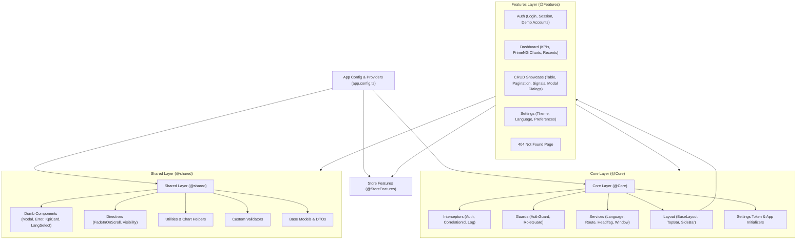

# SynergyFlow Web (`synergyflow-labs/web`)

An enterprise-grade web application built with **Angular 21**, **PrimeNG 21**,
**NgRx SignalStore**, and **Vite**. Engineered for clean separation of concerns,
effortless reusability, bidirectional internationalization (LTR/RTL), and high
code quality.

---

## Architecture Overview



---

## Tech Stack

| Technology                   | Purpose                     | Rationale                                                                                                                                            |
| :--------------------------- | :-------------------------- | :--------------------------------------------------------------------------------------------------------------------------------------------------- |
| **Angular 21**               | Frontend Framework          | Standalone components, reactive Signals (`signal`, `computed`, `input`, `output`), modern control flow (`@if`, `@for`, `@switch`), view transitions. |
| **PrimeNG 21 & Aura**        | UI Component Library        | Accessible, customizable component primitives styled with `@primeuix/themes` design tokens.                                                          |
| **@ngrx/signals**            | State Management            | Signal-native state management with modular features (`signalStoreFeature`).                                                                         |
| **@ngx-translate**           | Internationalization        | Full runtime English & Arabic translations with dynamic LTR/RTL bidirectional layout.                                                                |
| **Vitest & Testing Library** | Unit Testing                | Fast Vite-native test runner with V8 coverage and DOM testing utilities.                                                                             |
| **Playwright & Axe-Core**    | E2E & Accessibility         | End-to-end user journey tests and automated WCAG 2.1 AA accessibility audits.                                                                        |
| **ESLint 10 & Stylelint**    | Static Code Analysis        | Flat config rules, Angular template checks, CSS property ordering.                                                                                   |
| **Prettier & Husky**         | Code Formatting & Git Hooks | Automated pre-commit linting via `lint-staged`.                                                                                                      |
| **Docker & Nginx**           | Containerization            | Multi-stage container builds ready for production cloud hosting.                                                                                     |

---

## Project Structure & Directory Guide

Every architectural folder includes its own detailed `README.md` guide
explaining its specific scope, rules, and usage examples:

```text
modern-angular-project-template/
├── .github/                       # CI/CD workflows and automation
│   ├── workflows/ci.yml           # Automated lint, format, test, and build pipeline
│   └── README.md                  # CI/CD guide
├── e2e/                           # End-to-End and accessibility testing
│   ├── accessibility/             # Axe-core automated WCAG 2.1 AA audits
│   ├── pages/                     # Page Object Models (POM)
│   ├── specs/                     # Functional browser tests
│   └── README.md                  # E2E test guide
├── public/                        # Static assets served at root
│   ├── assets/i18n/               # Translation JSON files (en.json, ar.json)
│   ├── favicon.svg                # Application favicon
│   └── README.md                  # Static assets guide
├── src/
│   ├── app/
│   │   ├── core/                  # Application singletons & global infrastructure (@Core)
│   │   │   ├── breadcrumbs/       # Dynamic route breadcrumbs service & models
│   │   │   ├── config/            # AppSettings, theme presets, language & role configs
│   │   │   ├── guards/            # Functional authGuard & roleGuard
│   │   │   ├── interceptors/      # HTTP interceptors (JWT, tracing, logging)
│   │   │   ├── layout/            # BaseLayout, TopBar, and SideBar navigation
│   │   │   ├── services/          # LanguageService, HeadTagService, WindowService
│   │   │   └── README.md          # Core architecture rules
│   │   ├── features/              # Self-contained business domains (@Features)
│   │   │   ├── auth/              # Authentication, login form, dual-mode session
│   │   │   ├── dashboard/         # KPI metrics, Chart.js trends, recent events
│   │   │   ├── crud-example/      # Complete CRUD pattern with NgRx SignalStore
│   │   │   ├── settings/          # User profile preferences and language settings
│   │   │   ├── not-found/         # 404 error page with route recovery
│   │   │   └── README.md          # Feature module guidelines
│   │   ├── shared/                # Reusable, stateless presentation layer (@shared)
│   │   │   ├── components/        # Dumb UI components (ConfirmModal, FieldError, KpiCard)
│   │   │   ├── directives/        # DOM directives (FadeInOnScroll)
│   │   │   ├── models/            # Generic models & DTOs (User, PaginatedList)
│   │   │   ├── styles/            # PrimeNG component theme overrides
│   │   │   ├── utils/             # Pure helper functions & chart palette tokens
│   │   │   ├── validators/        # Custom reactive form validators
│   │   │   └── README.md          # Shared component guidelines
│   │   ├── app.config.ts          # Application provider graph & initializers
│   │   ├── app.routes.ts          # Root routing table with lazy loading
│   │   ├── app.ts / .html / .css  # Root bootstrap component
│   │   └── README.md              # Root app guide
│   ├── environments/              # Build-time environment configs (@Environments)
│   │   ├── environment.ts         # Base environment schema
│   │   ├── environment.development.ts # Development environment config
│   │   ├── environment.production.ts  # Production environment config
│   │   └── README.md              # Environment management guide
│   ├── store-features/            # Reusable NgRx SignalStore extensions (@StoreFeatures)
│   │   ├── with-request-status.feature.ts # Async status tracker (pending/error/fulfilled)
│   │   └── README.md              # SignalStore extensions guide
│   ├── index.html                 # Single page application HTML shell
│   ├── main.ts                    # Application bootstrap entry point
│   └── styles.css                 # Global CSS variables, reset, and logical properties
├── angular.json                   # Angular workspace configuration
├── eslint.config.js               # ESLint 10 flat configuration
├── package.json                   # Dependencies and npm scripts
├── playwright.config.ts           # Playwright E2E configuration
├── tsconfig.json                  # TypeScript compiler options and path aliases
└── vitest.config.ts               # Vitest unit test configuration
```

---

## Getting Started

### Prerequisites

- **Node.js**: `v22.x` or later
- **npm**: `v10.x` or later

### Installation

```bash
# Clone or copy the template
cd modern-angular-project-template

# Install dependencies
npm install
```

### Local Development Server

```bash
npm start
```

Navigate to `http://localhost:4200/`.

> [!TIP] **Out-of-the-Box Mock Mode**: The template ships with
> `useMockAuth: true` enabled in development. You can log in immediately on the
> login page using the quick **Admin** or **User** buttons (Password:
> `Admin@123`) without needing a live backend API server.

---

## Scripts & Quality Gates

| Command                 | Description                                            |
| :---------------------- | :----------------------------------------------------- |
| `npm start`             | Launches development server on `http://localhost:4200` |
| `npm run build`         | Compiles production bundle with budget verification    |
| `npm run watch`         | Builds and watches for changes in development mode     |
| `npm test`              | Runs all unit test suites using Vitest                 |
| `npm run test:watch`    | Runs Vitest in interactive watch mode                  |
| `npm run test:coverage` | Runs unit tests and outputs V8 code coverage report    |
| `npm run lint`          | Lints TypeScript and HTML templates with ESLint        |
| `npm run lint:fix`      | Automatically fixes autofixable ESLint warnings        |
| `npm run lint:css`      | Lints stylesheets with Stylelint                       |
| `npm run format:check`  | Checks code formatting with Prettier                   |
| `npm run format`        | Auto-formats code with Prettier                        |
| `npm run test:e2e`      | Runs Playwright end-to-end tests                       |
| `npm run test:a11y`     | Runs automated accessibility audits with Axe-Core      |

---

## Core Architectural Patterns

### 1. State Management with NgRx SignalStore

State is isolated inside feature stores using `@ngrx/signals`. Asynchronous
operations are managed cleanly with the reusable `withRequestStatus()` feature:

```typescript
export const ItemStore = signalStore(
  withState({ items: [], totalCount: 0 }),
  withRequestStatus(),
  withMethods((store, service = inject(ItemService)) => ({
    async loadItems() {
      patchState(store, setPending("loadItems"));
      try {
        const data = await firstValueFrom(service.getItems());
        patchState(
          store,
          { items: data.items, totalCount: data.totalCount },
          setFulfilled("loadItems"),
        );
      } catch (err: any) {
        patchState(store, setError("loadItems", err.message));
      }
    },
  })),
);
```

### 2. Internationalization & Bidirectional Layout (LTR/RTL)

The template supports instantaneous switching between English (LTR) and Arabic
(RTL):

- Handled via `LanguageService` which updates `<html lang="..." dir="...">`
  dynamically.
- Uses the native browser **View Transitions API** for smooth visual transition
  when changing languages.
- Styles use **CSS Logical Properties** (`margin-inline`, `padding-block`,
  `inset-inline-start`, `border-inline-end`) ensuring zero layout recalculation
  overhead in RTL.

### 3. Accessible UI & Forms

- Reactive forms leverage `CustomValidators` (e.g. `trimMinLength`,
  `strongPassword`, `match`).
- Validation feedback uses `app-field-error` with `aria-live="polite"` and ARIA
  description binding.
- High-impact deletions require typed confirmation phrases using
  `app-confirm-action-modal`.

---

## Recommendations & Scaling Advice

1. **Strict Dependency Hierarchy**:
   - Features (`@Features`) must never import directly from sibling features.
   - Cross-feature coordination should happen via URL routes or singleton
     services in `@Core`.
   - Keep `@shared` strictly for stateless presentational components.
2. **Signals vs RxJS**:
   - Use **Signals** for synchronous UI state, derived data (`computed()`),
     inputs/outputs, and DOM bindings.
   - Use **RxJS** for asynchronous event streams, debounce/throttling,
     WebSocket/SignalR connections, and HTTP pipelines.
3. **Lazy-Load Everything**:
   - Always configure feature routes with `loadComponent: () => import(...)` to
     ensure code splits cleanly into lightweight chunks.
4. **Performance Budgets**:
   - Keep initial bundle budgets below `1MB` (configured in `angular.json`).
   - Heavy libraries (charts, rich editors) should always be loaded inside lazy
     feature routes.
5. **Accessibility as a Quality Gate**:
   - Run `npm run test:a11y` in your CI pipeline to catch WCAG violations early.

---

## Docker Support

Run the application in a local containerized environment:

```bash
docker compose up --build
```

Access the app at `http://localhost:4200`.
