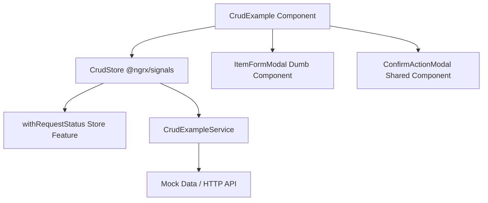

# CRUD Showcase Feature (`src/app/features/crud-example`)

This feature demonstrates the complete enterprise architecture pattern for data management in modern Angular.

## Architecture Pattern

## Key Architectural Principles Demonstrated

1. **State Isolation (`CrudStore`)**: Managed entirely via `@ngrx/signals` with `withRequestStatus()`. Components bind directly to reactive signals (`store.items()`, `store.isPending()('loadItems')`).
2. **Smart / Dumb Separation**:
   * `CrudExample` is the **smart container** component coordinating the store and modal states.
   * `ItemFormModal` is a **dumb presentational component** receiving inputs (`[visible]`, `[item]`) and emitting outputs (`(save)`, `(cancel)`).
3. **Data Protection**: Deletions invoke `ConfirmActionModal`, requiring the user to type the item's name to prevent accidental destruction.
4. **Resilient Error Handling**: Network failures render `app-operation-failed` with a functional retry hook.
